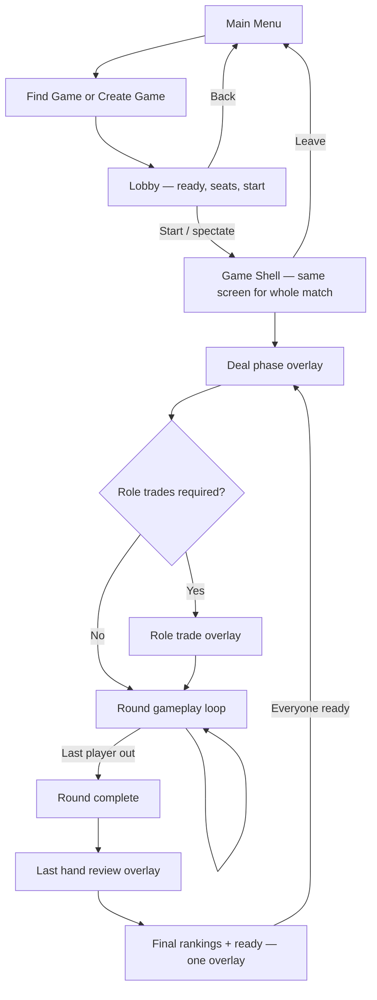
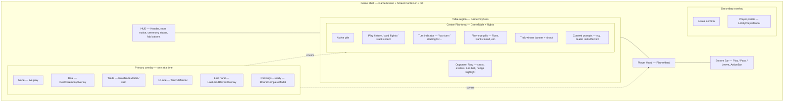
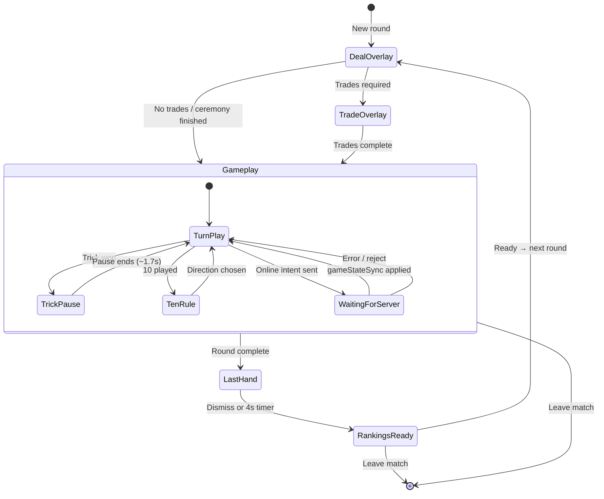

# Game UI & match architecture

Player-facing states and component ownership for Presidents & Arseholes. Use this when tracking UI bugs, adding features, or onboarding developers.

For server sync, dead hand, and bot tables see [MULTIPLAYER_ARCHITECTURE.md](./MULTIPLAYER_ARCHITECTURE.md).

---

## 1. App ownership (reference diagram)

```
App
├─ Main Menu                    (src/screens/MainMenu.tsx)
├─ Find Game                    (src/screens/FindGame.tsx)
├─ Create Game                  (src/screens/CreateGame.tsx — host + join lobby)
├─ Lobby                        (inside Create Game — ready, seats, start)
└─ Game Screen                  (src/screens/GameScreen.tsx — persistent for the match)
    ├─ Opponent Ring            (src/components/OpponentRing.tsx via GamePlayArea)
    ├─ Centre Play Area         (src/components/GameTable.tsx + play flights in GamePlayArea)
    ├─ Player Hand              (src/components/PlayerHand.tsx)
    ├─ Bottom Bar               (src/components/BottomBar.tsx — hand + ActionBar)
    ├─ Primary Overlay          (deal, trade, last hand, rankings+ready, 10-rule)
    └─ Secondary Overlay        (leave confirm, player profile, settings/achievements from App)
```

**Navigation (`App.tsx`):** Menu → Find or Create → Lobby → **Start / spectate** → Game Screen. Leaving the match unmounts Game Screen and returns to menu (or Find).

---

## 2. Match lifecycle (player-facing)



**Round gameplay loop (inside the box):** turns → play/pass → trick resolves (table pause, winner banner) → players go out → repeat until round complete.

**Known ordering issue (online):** Final rankings can flash before last hand if `gameStateSync` marks the round complete before `roundEnded` delivers `lastPlayerHand`. Intended order is always last hand → rankings.

---

## 3. Game Shell hierarchy

The shell stays mounted; **one primary overlay** (plus optional secondary modals) sits above the table.



**Centre Play Area bugs** (pills shifting with empty pile, pills behind avatars) are localized to `GameTable.tsx` layout and z-order vs `OpponentRing` — not the hand or bottom bar.

| Centre sub-area | Main code |
|-----------------|-----------|
| Active pile | `GameTable` pile / stacks |
| Play history / animations | `GamePlayArea` flights, `TableCardFlight`, trick pause snapshot |
| Turn indicator | `GameTable` turn hint pill (`formatWaitingForTurnHint`) |
| Play-type pills | `GameTable` play-type badge row |
| Trick winner banner | `GameTable` winner overlay; driven from `GameScreen` trick pause |
| Context prompts | Reshuffle overlay, ceremony status pill, away banner |

---

## 4. Overlay & gameplay state machine



### WaitingForServer (online only)

Players do not see a separate screen. It is implemented when:

- `actionPending` is true after Play/Pass until the next authoritative snapshot, and/or
- `readOnlyGame` blocks input during that window.

That separates **“I tapped Play”** from **“the server accepted it and the table moved.”** Most multiplayer desync bugs involve acting during or after this gap without treating it as its own phase.

| Player action | Client | Server |
|---------------|--------|--------|
| Play / Pass | `gameAction` only; no local `playCards` | Validates → `playCards` / `passTurn` → `gameStateSync` |
| Ready (next round) | `playerReadyForNextRound` | `tryStartNextRoundIfReady` → `nextRoundStarting` + new deal |

### Primary overlay visibility (GameScreen)

| Overlay | Rough condition |
|---------|----------------|
| Deal | `ceremonyPrep` set |
| Trade | `tradePhase` + active trade |
| 10-rule | `tenRulePending` + human chooser |
| Last hand | `lastHandReveal` |
| Rankings + ready | `roundOver && !lastHandReveal && !ceremonyPrep && !tradePhase` |
| None | Otherwise (gameplay or WaitingForServer) |

---

## 5. Primary vs secondary overlays

| Layer | Components | Purpose |
|-------|------------|---------|
| **Primary** | `DealCeremonyOverlay`, `RoleTradeModal`, `LastHandRevealOverlay`, `RoundCompleteModal`, `TenRuleModal` | Block table until phase completes |
| **Secondary** | `LeaveGameConfirmModal`, `LobbyPlayerModal` | Confirmations / inspect player without ending the match |

Rankings and **Ready for next round** share **`RoundCompleteModal`** — there is no separate Ready overlay.

---

## 6. Related docs

- [MULTIPLAYER_ARCHITECTURE.md](./MULTIPLAYER_ARCHITECTURE.md) — server authority, `stateVersion`, dead hand, bot loop
- [QA_BOT_LEAGUE.md](./QA_BOT_LEAGUE.md) — **QA League** easter egg + autonomous harness (`npm run qa-league` → `reports/qa/latest/AGENT_BRIEF.md` for agent iteration)
- `src/screens/updateLogContent.ts` — player-facing release notes
