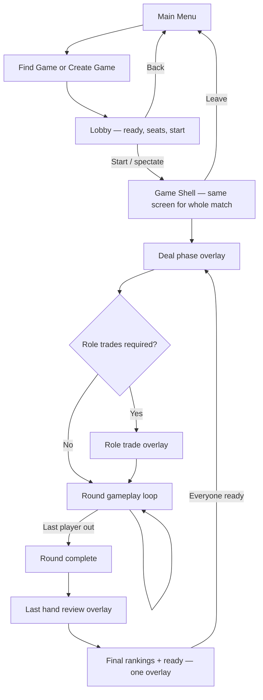
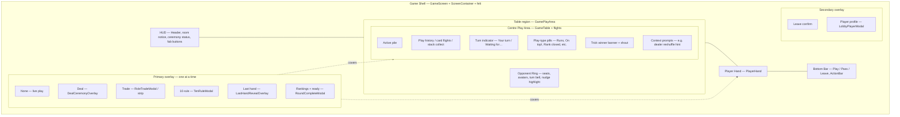
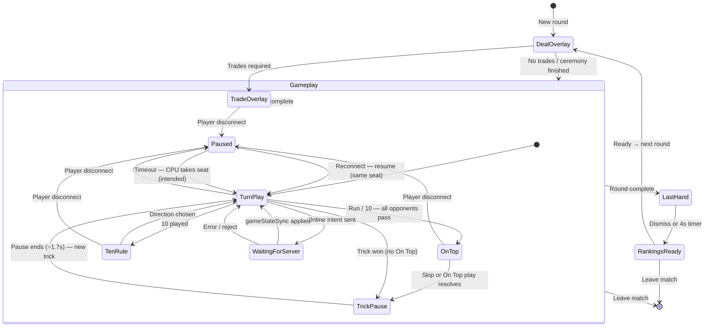

# Game UI & match architecture

Player-facing states and component ownership for Presidents & Arseholes. Use this when tracking UI bugs, adding features, or onboarding developers.

For server sync, dead hand, and bot tables see [MULTIPLAYER_ARCHITECTURE.md](./MULTIPLAYER_ARCHITECTURE.md).

---

## 1. App ownership (reference diagram)

```
App
├─ Main Menu                    (src/screens/MainMenu.tsx)
├─ Find Game                    (src/screens/FindGame.tsx)
├─ Create Game                  (src/screens/CreateGame.tsx — host + join lobby)
├─ Lobby                        (inside Create Game — ready, seats, start)
└─ Game Screen                  (src/screens/GameScreen.tsx — persistent for the match)
    ├─ Opponent Ring            (src/components/OpponentRing.tsx via GamePlayArea)
    ├─ Centre Play Area         (src/components/GameTable.tsx + play flights in GamePlayArea)
    ├─ Player Hand              (src/components/PlayerHand.tsx)
    ├─ Bottom Bar               (src/components/BottomBar.tsx — hand + ActionBar)
    ├─ Primary Overlay          (deal, trade, last hand, rankings+ready, 10-rule)
    └─ Secondary Overlay        (leave confirm, player profile, settings/achievements from App)
```

**Navigation (`App.tsx`):** Menu → Find or Create → Lobby → **Start / spectate** → Game Screen. Leaving the match unmounts Game Screen and returns to menu (or Find).

---

## 2. Match lifecycle (player-facing)



**Round gameplay loop (inside the box):** turns → play/pass → optional **On Top** (same trick) → trick resolves (table pause, winner banner) → players go out → repeat until round complete.

**Known ordering issue (online):** Final rankings can flash before last hand if `gameStateSync` marks the round complete before `roundEnded` delivers `lastPlayerHand`. Intended order is always last hand → rankings.

---

## 3. On Top

**On Top is not a new trick.** It is the final optional action of the **current** trick.

### When On Top is available

On Top is a special opportunity available only after:

- **Runs** — everyone else passes without extending the run
- **10 Higher** — everyone else passes on the 10 pile
- **10 Lower** — everyone else passes on the 10 pile

### Ownership

The **On Top decision belongs to the player who won the trick** — the last player who played successfully before everyone else passed.

That player is the only seat that may act during On Top. Opponents remain locked out (already passed for this trick).

| Context | Who owns On Top |
|---------|-----------------|
| Run ended by passes | Last player who extended / played on the run |
| 10 Higher / Lower ended by passes | Player who played the 10 and chose the direction |

Authoritative flag: `runOnTop.playerIndex` (and matching `currentPlayerIndex` while the beat is active).

### Resolution

When all opponents pass:

1. The **winning player** receives the On Top opportunity (trick outcome is decided; On Top is optional follow-through).
2. If they have a **legal On Top play**, they may choose to play it.
3. The On Top play is a **single additional play** within the same trick.
4. **Skipping On Top** (pass on the beat) **immediately ends the trick** — no further plays in that trick.
5. After On Top resolves (play or skip), the **current trick ends**.
6. A **new trick** begins with the **same player leading**.

On Top is **optional**. Taking it can be strategically beneficial (extend pressure, burn a strong card) or harmful (leave the player leading into a weak position).

### Lifecycle

```
Run or 10 context
        ↓
All opponents pass
        ↓
Winning player receives On Top opportunity  ← still the same trick
        ↓
Player chooses:
  Play On Top
  or
  Skip (pass) → trick ends immediately
        ↓
Trick ends
        ↓
New trick begins (same player leads)
```

**UI note:** The **On top!** pill and flash on the table signal this opportunity; it is not a separate overlay or screen.

---

## Turn ownership (`currentPlayerIndex`)

**Intent:** During active gameplay, `currentPlayerIndex` is the **authoritative** seat — who may play or pass on the **current** turn (subject to phase rules below). The server validates `gameAction` against this index; bot loops gate CPU steps on it.

| Context | Who owns the turn |
|---------|-------------------|
| Normal trick play | Next living seat that has not passed this trick (clockwise from last action) |
| Run on-top beat | `runOnTop.playerIndex` (leader’s optional beat; may have passed earlier in the trick) |
| 10-rule pending | Frozen; chooser is the player who played the 10 (`tenRuleChooserIndex`) |
| Acknowledgment pass (joker / rank-close) | Concurrent ack passes; leader may wait while others acknowledge |
| Trick / round complete | Pointer not authoritative until next deal |
| Disconnect pause (standard rooms) | Snapshot **frozen**; away player may still be `currentPlayerIndex` until reconnect or grace expiry |

**UI:** Turn hints (“Your turn” / “Waiting for…”) may use `resolveDisplayTurnPlayerIndex` when the authoritative pointer is temporarily stale. Authoritative and display indices **should** match after every server commit.

**Implementation debt:** See [ARCHITECTURE_GAPS.md](./ARCHITECTURE_GAPS.md) — **Turn Ownership Invariant** and [TURN_OWNERSHIP_INVESTIGATION.md](./TURN_OWNERSHIP_INVESTIGATION.md). Root issue: `nextActivePlayerIndex` returns `fromIndex` when no seat can act, forcing downstream repair (`repairStuckTurnPointer`, `advancePastInactiveSeats`) instead of explicit trick resolve.

---

## 4. Game Shell hierarchy

The shell stays mounted; **one primary overlay** (plus optional secondary modals) sits above the table.



**Centre Play Area bugs** (pills shifting with empty pile, pills behind avatars) are localized to `GameTable` layout and z-order vs `OpponentRing` — not the hand or bottom bar.

| Centre sub-area | Main code |
|-----------------|-----------|
| Active pile | `GameTable` pile / stacks |
| Play history / animations | `GamePlayArea` flights, `TableCardFlight`, trick pause snapshot |
| Turn indicator | `GameTable` turn hint pill (`formatWaitingForTurnHint`) |
| Play-type pills | `GameTable` play-type badge row |
| Trick winner banner | `GameTable` winner overlay; driven from `GameScreen` trick pause |
| Context prompts | Reshuffle overlay, ceremony status pill, away / disconnect banner |

---

## 5. Overlay & gameplay state machine



**On Top in the diagram:** `OnTop` is a branch inside `Gameplay`, not a sibling of `DealOverlay` or `LastHand`. The trick does not fully resolve until On Top is played or skipped.

**Disconnect in the diagram:** `Paused` is a gameplay interruption — no separate screen. The Game Shell stays mounted; input is frozen until the server resumes or substitutes a CPU.

### WaitingForServer (online only)

Players do not see a separate screen. It is implemented when:

- `actionPending` is true after Play/Pass until the next authoritative snapshot, and/or
- `readOnlyGame` blocks input during that window.

That separates **“I tapped Play”** from **“the server accepted it and the table moved.”** Most multiplayer desync bugs involve acting during or after this gap without treating it as its own phase.

| Player action | Client | Server |
|---------------|--------|--------|
| Play / Pass | `gameAction` only; no local `playCards` | Validates → `playCards` / `passTurn` → `gameStateSync` |
| Ready (next round) | `playerReadyForNextRound` | `tryStartNextRoundIfReady` → `nextRoundStarting` + new deal |

### Primary overlay visibility (GameScreen)

| Overlay | Rough condition |
|---------|----------------|
| Deal | `ceremonyPrep` set |
| Trade | `tradePhase` + active trade |
| 10-rule | `tenRulePending` + human chooser |
| Last hand | `lastHandReveal` |
| Rankings + ready | `roundOver && !lastHandReveal && !ceremonyPrep && !tradePhase` |
| None | Otherwise (gameplay, On Top, WaitingForServer, or disconnect pause) |

---

## 6. Disconnect, reconnect, and pause

### Disconnect timing

A disconnect **pauses the match immediately** for standard online rooms (not bot-open tables — see implementation notes below).

The game state **freezes at the exact point** the disconnect is recorded:

| Interrupted moment | Preserved while paused |
|--------------------|------------------------|
| Mid turn (Play / Pass) | Turn pointer, pile, hands |
| During 10-rule selection | `tenRulePending`, chooser seat |
| During trade selection | Pending trades, partial picks |
| During On Top decision | `runOnTop`, trick pile, pass locks |
| During Rankings + Ready | Finish order, ready map |

**No gameplay advances** while paused. The server remains authoritative; clients must not apply local play/pass, ceremony steps, or ready aggregation during the pause (`readOnlyGame` / `isGamePausedForAway` on the client; `gameAction` rejection on the server).

#### Round completion during disconnect

If a disconnect occurs while a game action is already being resolved on the server:

1. The server **completes resolution** of the current in-flight `gameAction` (or trade / ready handler).
2. The resulting authoritative snapshot is saved.
3. The match **then pauses** on the next disconnect event (or immediately if the disconnected socket was not mid-request).

The game should **never** stop halfway through resolving a legal action — only after the server commits or rejects that action.

### Disconnect and reconnect

A disconnect **pauses the match** at the exact point the player left. The game state is preserved on the server.

The disconnected player **retains seat ownership**:

- Turn ownership (`currentPlayerIndex` — see § Turn ownership)
- Pending decisions (10-rule choice, trade pick, On Top)
- Hand, role, and ready state in `gameState`
- Lobby membership row (`disconnectedAt` set; player **not** removed until grace expires)

When the player reconnects **before the grace timer expires**:

- Rejoin uses the same `playerId` / profile id (`findReconnectPlayer` in `server/index.js`).
- `disconnectedAt` clears; removal timer is cancelled.
- The game resumes from the **exact paused state** — **immediately**, not at a round boundary.
- Play continues from the interrupted action.

Examples that must resume cleanly:

| Interrupted moment | On reconnect |
|--------------------|--------------|
| Mid turn (Play / Pass) | Same seat, same turn |
| During 10-rule choice | Same chooser, same pending direction |
| During trade selection | Same trade step, same picks in flight |
| During Rankings + Ready | Same rankings, same ready flags |
| During On Top opportunity | Same trick, same optional beat for the trick winner |

### Disconnect timeout

When a seated human disconnects in a **standard online room**:

1. Match pauses (`isGamePausedForAway`).
2. Reconnect timer begins.
3. **Intended timeout: 15 seconds.**

| Outcome | Intended behaviour |
|---------|-------------------|
| Reconnect before timeout | Resume play from preserved state; same seat, same `playerId` |
| Timeout expires | CPU temporarily controls the seat; match continues; seat stays owned by the human |
| Original player returns later | Reclaims the same seat when reconnect rules allow (see below) |

> **TODO (implementation):** In-game grace is currently **20–30 s random** (`IN_GAME_AWAY_GRACE_MIN_MS` / `MAX` in `server/index.js`), not a fixed 15 s. Align constants and UI copy with the intended 15 s timeout.

### CPU takeover

When a disconnected player **exceeds the reconnect timeout** (intended behaviour):

1. The **human remains the owner** of the seat (`playerId` unchanged in `gameState`).
2. A **CPU temporarily takes control** of that seat for play decisions.
3. The **match resumes** — other players are unpaused.
4. The seat is **not** considered vacant.
5. The seat is **not** promoted to dead hand.

The substitute CPU acts only as a controller for the owned seat until the human returns or multiplayer seating rules say otherwise.

> **TODO (implementation):** Standard online rooms currently call `abortOnlineGame` on timeout and remove the player — the match **ends**, there is **no CPU substitute**. Bot-open tables (`BOTOPN`) demote the human to **spectator** immediately on disconnect and never pause. CPU seat handoff for private rooms is **not shipped**; this subsection documents the **target** behaviour.

### Returning after CPU takeover

**Intended rules:**

| Question | Intended answer |
|----------|-----------------|
| Can the original player reclaim the seat immediately? | **Yes**, on reconnect while the match is still active — same profile id, same seat row, CPU relinquishes control instantly. |
| Instant or round boundary? | **Instant** — reclaim is not deferred to the next deal or rankings phase. |
| What happens to the temporary CPU? | CPU stops acting for that seat as soon as the human socket is live again; no separate CPU profile persists. |

> **TODO (implementation):** Reconnect-before-timeout **does** restore the human instantly today. After timeout, the match aborts instead of CPU takeover, so late reconnect cannot resume the same round on standard rooms. Document and implement CPU handoff + late reclaim when shipping this feature.

### Pause state presentation

When a player disconnects and the match pauses, **all seated players** should see a clear pause state (no separate screen — banner + seat styling on the Game Shell):

**Intended copy (example):**

```
Match paused
Alex disconnected
Waiting for reconnect
14…
13…
12…
```

**Minimum information:**

- Match is paused
- Which player disconnected
- Reconnect countdown (seconds remaining)

**Current client behaviour (partial):**

- Top banner via `awayNotice`: `Game paused — waiting for {name} to return ({secs}s)`
- Disconnected seats dimmed in `OpponentRing` (`disconnectedPlayerIds`)
- Server rejects actions with `Game paused — waiting for a player to reconnect`

> **TODO (implementation):** Multi-line pause layout and per-second countdown lines are not fully implemented; countdown is a single updating banner string. Lobby disconnect uses 15 s grace; in-game uses 20–30 s (see timeout TODO above).

### Server authority during disconnects

- The **server remains authoritative** while paused.
- **Clients never advance gameplay** during a disconnect pause.
- All resumed gameplay must originate from the server's preserved `gameState` and `stateVersion`.
- `gameAction`, trade submission, and ready toggles from other players are blocked until away players reconnect or CPU takeover resumes the match (intended).

### Bot-open table exception

`BOTOPN` rooms follow different disconnect rules today: humans are **demoted to spectator** on disconnect, bots keep playing, and `isGamePausedForAway` is **false**. That table type is documented in [MULTIPLAYER_ARCHITECTURE.md](./MULTIPLAYER_ARCHITECTURE.md); do not assume pause / CPU takeover behaviour there until aligned with standard rooms.

---

## 7. Identity & persistence (future)

**Current architecture:**

- Local XP and progression (`playerStats`, device storage)
- Cloud stats sync per profile id where implemented
- Progress tied to browser / device / PWA install — not a full account system

**Future architecture (guidance only — not active implementation):**

- Account system with authenticated identity
- Server-side progression as source of truth
- Cross-device persistence (phone, desktop, reinstalled PWA)
- Recoverable achievements, unlocks, and career XP after reinstall or cleared browser data

**Purpose:** Prevent loss of XP, achievements, unlocks, and progression when a user reinstalls the PWA, clears browser data, or changes device. This section is planning context for GameScreen / Settings / cloud services — not a shipping feature.

---

## 8. Primary vs secondary overlays

| Layer | Components | Purpose |
|-------|------------|---------|
| **Primary** | `DealCeremonyOverlay`, `RoleTradeModal`, `LastHandRevealOverlay`, `RoundCompleteModal`, `TenRuleModal` | Block table until phase completes |
| **Secondary** | `LeaveGameConfirmModal`, `LobbyPlayerModal` | Confirmations / inspect player without ending the match |

Rankings and **Ready for next round** share **`RoundCompleteModal`** — there is no separate Ready overlay.

---

## 9. Related docs

- [MULTIPLAYER_ARCHITECTURE.md](./MULTIPLAYER_ARCHITECTURE.md) — server authority, `stateVersion`, dead hand, bot loop
- [ARCHITECTURE_GAPS.md](./ARCHITECTURE_GAPS.md) — documented intent vs implementation (incl. **Turn Ownership Invariant**)
- [TURN_OWNERSHIP_INVESTIGATION.md](./TURN_OWNERSHIP_INVESTIGATION.md) — `currentPlayerIndex` audit and investigation guide
- [CPU_STALL_INVESTIGATION.md](./CPU_STALL_INVESTIGATION.md) — bot loop stall when display turn ≠ authoritative turn
- [QA_BOT_LEAGUE.md](./QA_BOT_LEAGUE.md) — **QA League** easter egg + autonomous harness (`npm run qa-league` → `reports/qa/latest/AGENT_BRIEF.md` for agent iteration)
- `src/screens/updateLogContent.ts` — player-facing release notes
