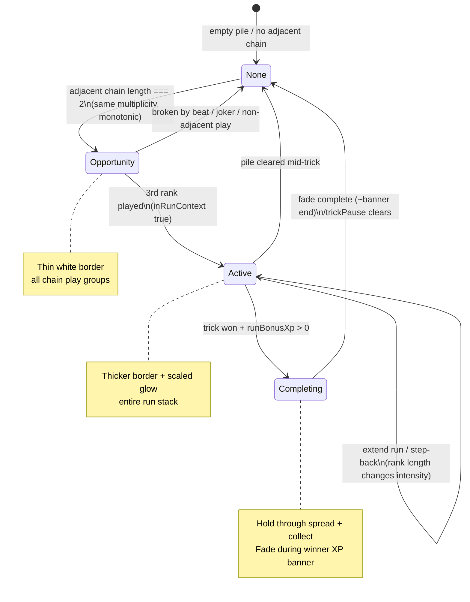

# Run Highlight System — Product Review & Implementation Plan

**Work item:** `wi-run-highlight-system`  
**Priority:** P2 Polish (Post-RC)  
**Date:** 2026-06-08  
**Recommendation:** **Ship with modifications** (design approved; small technical gaps and timing alignment called out below)

---

## Executive summary

The three-state run highlight concept (opportunity → active → completion fade) fits the product direction: white, minimal, readable, no rule changes. The table already communicates runs via **play-type pills** (`Runs!`, `Doubles`, `+N XP`) in `GameTable`, but those live **below** the card row and require reading text. Card-level borders/glow on the centre pile directly address the design goal (“glance at the centre pile”).

Implementation is **moderate scope (~350–450 LOC)**, **low gameplay risk** (render-only), with one **non-trivial gap**: **State 1 (run opportunity at 2 adjacent ranks) is not exposed by existing run helpers** — only 3+ ranks flip `inRunContext`. A thin UI-only derivation layer is required.

**Do not touch:** `isValidPlay`, turn ownership, XP math, server authority.

---

## UX recommendation

### Align with design intent

| State | Player reads | Proposed treatment |
|-------|----------------|-------------------|
| **1 — Opportunity** | “I can continue this sequence.” | 1–2px white border, ~40% opacity, soft shadow/glow on **all play groups** in the 2-rank adjacent chain. No pulse. |
| **2 — Active run** | “Run mode is active.” | Thicker border + brighter glow on **entire run stack** (every play group in the chain). Intensity scales with run **rank length** (3→6+), not card multiplicity alone. |
| **3 — Completion** | “That run just completed.” | Keep State 2 intensity through trick-end hold; smooth fade after XP celebration; never instant off. |

### Modifications vs spec (recommended)

1. **Highlight play groups, not only the top pile.** Runs are built from consecutive **plays** across `pileHistory` + `pile` (e.g. 8 on buried play, 9 on active play). Applying glow only to the top `pile` cards would miss the visual story. Wrap each affected **play group** in `GameTable` (all cards in that group).

2. **Opportunity detection needs a new derived signal.** Existing `resolveRunContext().inRunContext` is `false` until 3+ ranks (`MIN_RUN_CONTEXT_LENGTH`). State 1 must use a UI-only adjacent-chain detector (2 ranks, same multiplicity, monotonic step). Do **not** change `isValidPlay` or `inRunContext` semantics.

3. **Completion timing: piggyback trick pause, don’t add a second clock.** `GameScreen` already runs trick-end choreography (`TRICK_SPREAD_HOLD_MS` 380 → stack collect 520 → winner banner 800 → total 1700ms). Map State 3 fade to `showWinnerBanner` + `GameTable.fadeOut` rather than independent 300–500 / 600–1000ms timers (avoids fighting collect/stack animations).

4. **Coexist with pills, don’t duplicate loudly.** Keep `Runs!` / `+N XP` pills for explicit bonus feedback; card glow is the ambient signal. Optional follow-up: soften pill highlight when card glow is active (not required for v1).

5. **Intensity scale — use rank count from `runSeq`, not `runCardCountFromState`.** XP pool uses high-water **card** count (step-backs); visual intensity should track **visible consecutive ranks** so a step-back doesn’t flash max glow incorrectly. Use `runContextLengthFromState` / `runSeq.length` for tiers; use `runCardCountFromState` only for completion “was this a run trick?” (`runBonusXp > 0`).

### Suggested intensity table (rank length)

| Rank length | Border | Glow opacity (white shadow) |
|-------------|--------|-----------------------------|
| 2 (opportunity) | 1–2px | ~35–40% |
| 3 | 3px | ~40% |
| 4 | 3px | ~60% |
| 5 | 4px | ~80% |
| 6+ | 4px | ~100% (cap; no pulse) |

Platform note: prefer `shadowColor: '#fff'`, `shadowRadius`, and `borderColor: 'rgba(255,255,255,0.x)'` on a wrapper `View` around table cards. `Card` table variant is intentionally static (no transforms); avoid wiring `highlight` on hand variant.

---

## Technical investigation

### 1. Where run opportunity state exists today

**Partially — not as a first-class UI flag.**

| Source | Location | What it gives |
|--------|----------|---------------|
| `resolveRunContext` | `src/game/core.ts` ~947 | `runSeq`, `runMultiplicity`, `inRunContext` (`isRunContextSequence`, **≥3 ranks**) |
| `isAdjacentToPileTop` | `core.ts` ~991 | Whether **next** play extends pile (validation / hints) |
| `consecutiveSequenceInfo` | `core.ts` ~1363 | Run sequence for **≥3** ranks; returns empty for 2-rank chains |
| `getPlayTypePills()` | `GameScreen.tsx` ~5154 | Sets `Runs!` only when `inRunContext` — **no opportunity UI** |

**Gap:** Example 8♥ → 9♠ yields adjacent chain length 2 but `inRunContext === false` and pills stay on plain `Singles`/multiplicity labels.

### 2. Where active run state exists today

| Source | Location | What it gives |
|--------|----------|---------------|
| `inRunContext` | via `resolveRunContext` | Active run rules engaged (3+ ranks) |
| `activeRunXpPoolInfo` | `core.ts` ~1741 | `runLength`, `poolXp`, `pileLeaderId` — used in `GameScreen` for `runXpPoolAmount` |
| `collectRunPlaySteps` | `core.ts` ~1605 | Chronological `{ value, playerId }[]` for chain — **best map to play groups** |
| `runCardCountFromState` | `core.ts` ~1669 | High-water card count for XP display |
| Play pills | `GameScreen` ~5183–5215 | `Runs!` + count label + `+N XP` in `GameTable` |

### 3. Centre pile rendering & run metadata

| Layer | File | Role |
|-------|------|------|
| Play list | `src/utils/trickDisplay.ts` | `buildTrickPlayDisplays(state)` — chronological play groups, **no run metadata** |
| Screen | `src/screens/GameScreen.tsx` | `displayPlays`, pills, `runXpPoolAmount`, trick pause snapshot |
| Layout wrapper | `src/components/GamePlayArea.tsx` | Clones pill props onto `GameTable` child |
| Centre pile | `src/components/GameTable.tsx` | Renders play groups + `Card variant="table"`; badges in chrome layer |
| Card | `src/components/Card.tsx` | Table cards static; default border `rgba(255,255,255,0.14)` dark mode |

**No run metadata on `TrickPlayDisplay` today.** Highlight indices must be computed externally and passed as props (e.g. `runHighlightByPlayKey: Record<string, RunHighlightTier>`).

### 4. Smallest integration point

**Primary:** `GameTable.tsx` — apply wrapper border/glow per play group when keyed in highlight map.

**Secondary:** new `src/utils/runHighlight.ts` — pure derivation from `GameState` (+ trick pause snapshot for completion):

```typescript
type RunHighlightPhase = "none" | "opportunity" | "active" | "completing";

type RunHighlightViewModel = {
  phase: RunHighlightPhase;
  rankLength: number;
  /** playDisplayKey → intensity 0..1 */
  playKeys: Map<string, number>;
  /** 0..1 for completion fade; driven by GameScreen trick pause phase */
  fadeOpacity?: number;
};
```

**Tertiary:** `GameScreen.tsx` — one `useMemo` building view model; pass through `GamePlayArea` → `GameTable`. Completion fade opacity tied to `trickPauseActive`, `showWinnerBanner`, `trickPauseSnapshot.runBonusXp`.

**Do not integrate in:** `core.ts` validation paths, server, `isValidPlay`.

---

## State diagram (mock)



### Trick-end timeline (existing vs proposed highlight)

```
0ms     trickPauseActive — highlight FULL (completing hold)
380ms   stackCollecting — highlight FULL on stacked pile
900ms   showWinnerBanner + XP — begin fade (600–800ms)
1700ms  trickPause ends — highlight gone
```

Align fade with `tableFadeAnim` / new `runHighlightFadeAnim` triggered when `showWinnerBanner && runBonusXp > 0`.

---

## Visual reference (ASCII — no screenshot in repo)

**Opportunity (8♥ 9♠):**

```
   ┌─────┐     ┌─────┐
   │ 8 ♥ │     │ 9 ♠ │   ← thin white rim, faint glow
   └─────┘     └─────┘
        (buried) (active)
```

**Active (8-9-10 run):**

```
   ┌═════┐     ┌═════┐     ┌═════┐
   ║ 8 ♥ ║     ║ 9 ♠ ║     ║10 ♦ ║   ← thicker rim, brighter glow
   └═════┘     └═════┘     └═════┘
   [Runs!]  [Doubles]  +15 XP        ← existing pills unchanged
```

**Precedent in codebase:** `GameTable` already animates white flash for **On top!** pill (`onTopFlashAnim`, ~600ms loop). Run highlight should **not** loop — static or one-shot fade only.

---

## Files affected & effort

| File | Change | Est. LOC |
|------|--------|----------|
| `src/utils/runHighlight.ts` | **New** — phase detection, opportunity chain, play-key mapping, intensity scale | 120–180 |
| `src/screens/GameScreen.tsx` | `useMemo` view model; completion fade inputs from trick pause | 30–45 |
| `src/components/GamePlayArea.tsx` | Pass highlight props to cloned `GameTable` | 10–20 |
| `src/components/GameTable.tsx` | Per-play-group wrapper border/shadow; optional fade `Animated.Value` | 80–120 |
| `src/utils/trickDisplay.ts` | Optional: export `playDisplayKey` if not already shared | 0–5 |
| Tests (`scripts/test-run-highlight.ts` or extend `test-run-detection.ts`) | Derivation unit tests (opportunity / active / step-back mapping) | 60–90 |

**Total:** ~350–450 LOC  
**Duration:** ~1–1.5 dev days + half day QA (visual + multiplayer sync spot check)

---

## State source summary

| UI state | Authoritative source | Notes |
|----------|---------------------|-------|
| Opportunity | **New** UI derivation (2-rank adjacent chain) | Not `inRunContext` |
| Active | `resolveRunContext().inRunContext` + `collectRunPlaySteps` | Map steps → `displayPlays` keys |
| Intensity tier | `runSeq.length` (rank count) | Not XP high-water |
| Live XP pill | `activeRunXpPoolInfo` (existing) | Unchanged |
| Completion | `trickPauseSnapshot.runBonusXp > 0` + pause timers | Fade with banner |
| Frozen pile during end | `trickPauseSnapshot.plays` (existing) | Same plays as highlight target |

---

## Risk assessment

| Risk | Severity | Mitigation |
|------|----------|------------|
| Wrong play groups highlighted (history vs trick) | Medium | Unit test mapping against `scripts/test-run-detection.ts` scenarios; use `collectRunPlaySteps` |
| Opportunity false positives (10 rule, quads context) | Medium | Suppress when `tenRulePending`, `fourOfAKindChallenge`, joker on pile, or `runOnTop` (On top! uses pill flash instead) |
| Step-back rank length vs XP card count mismatch | Low | Intensity from `runSeq.length`; completion from `runBonusXp` |
| Multiplayer desync | Low | Pure function of synced `GameState`; no client-only state except fade phase (all clients run same trick pause) |
| Performance (shadow on many cards) | Low | Only chain play groups (~2–8 groups); no particles |
| Accessibility / dark felt | Low | White-only spec; test on grey felt + dark mode cards |
| Scope creep (achievements, cosmetics) | Low | Pass `intensity` number; future themes swap color in one wrapper |

---

## Future compatibility

Architecture supports later expansion without rework:

- `RunHighlightViewModel.playKeys` is a generic map → future **long-run achievement** pulse can bump intensity on threshold ranks.
- Phase enum allows a fourth **celebration** state for seasonal cosmetics.
- Keep color token in one place (`RUN_HIGHLIGHT_COLOR = '#ffffff'`) for theme swaps.

Constraints for v1: white, minimalist, no particles, no rule changes.

---

## Testing plan (when implemented)

1. **Unit:** opportunity (8-9), active (8-9-10), step-back (J-Q-J-K intensity from ranks not cards), quads run extension, joker breaks highlight.
2. **Visual:** local 4-player mock — verify 2-card opportunity before third play; glow scales at 3/4/5/6 ranks.
3. **Trick end:** run trick with `runBonusXp > 0` — highlight holds through collect, fades during banner, gone when pause ends.
4. **Multiplayer:** two clients same room — same highlight on same beat (state-derived).
5. **Regression:** `npm run test-core`, `test-run-detection.ts` unchanged (no core edits).

---

## Recommendation

### **Ship with modifications**

| Aspect | Verdict |
|--------|---------|
| Overall concept | **Approve** — fills readability gap pills don’t cover |
| State 1 opportunity | **Approve** — requires new UI derivation (documented above) |
| State 2 active + scaling | **Approve** — wire to `collectRunPlaySteps` + rank length |
| State 3 completion | **Approve with timing tweak** — bind fade to existing trick pause / XP banner |
| Scope | **Reject** particle systems, rainbow, rule changes |

**Not recommended:** Rejecting the feature — low risk, clear player value post-RC.

**Defer until:** RC ship complete (P2 polish per work item priority); no `ARCHITECTURE_GAPS.md` blocker.

---

## Related code references

- Run context: `resolveRunContext`, `MIN_RUN_CONTEXT_LENGTH = 3` — `src/game/core.ts`
- Play steps for mapping: `collectRunPlaySteps` — `src/game/core.ts`
- Pills + XP today: `getPlayTypePills`, `runXpPoolAmount` — `src/screens/GameScreen.tsx`
- Centre render: play group loop — `src/components/GameTable.tsx` ~431–550
- Trick completion XP: `TrickPauseSnapshot.runBonusXp`, `TRICK_PAUSE_TOTAL_MS` — `src/screens/GameScreen.tsx`
